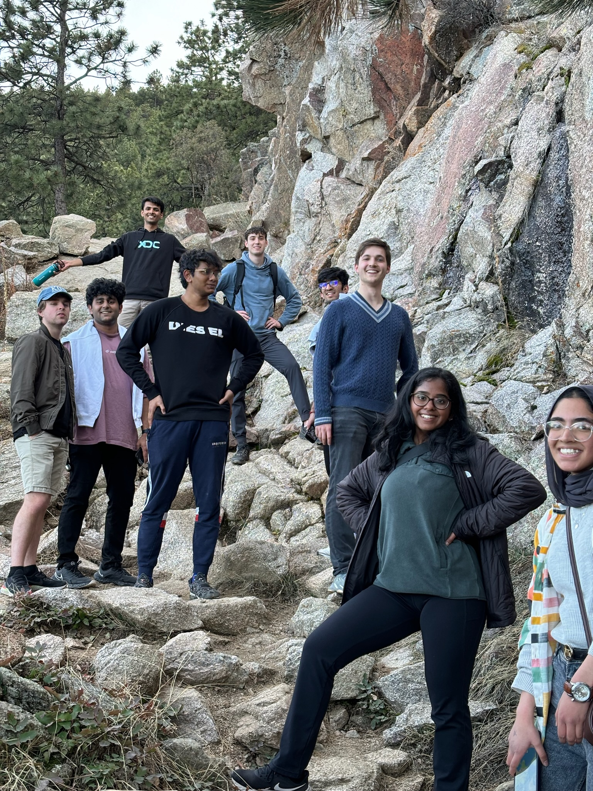
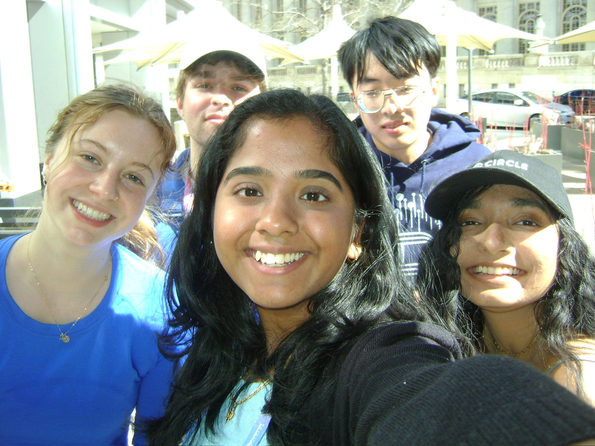
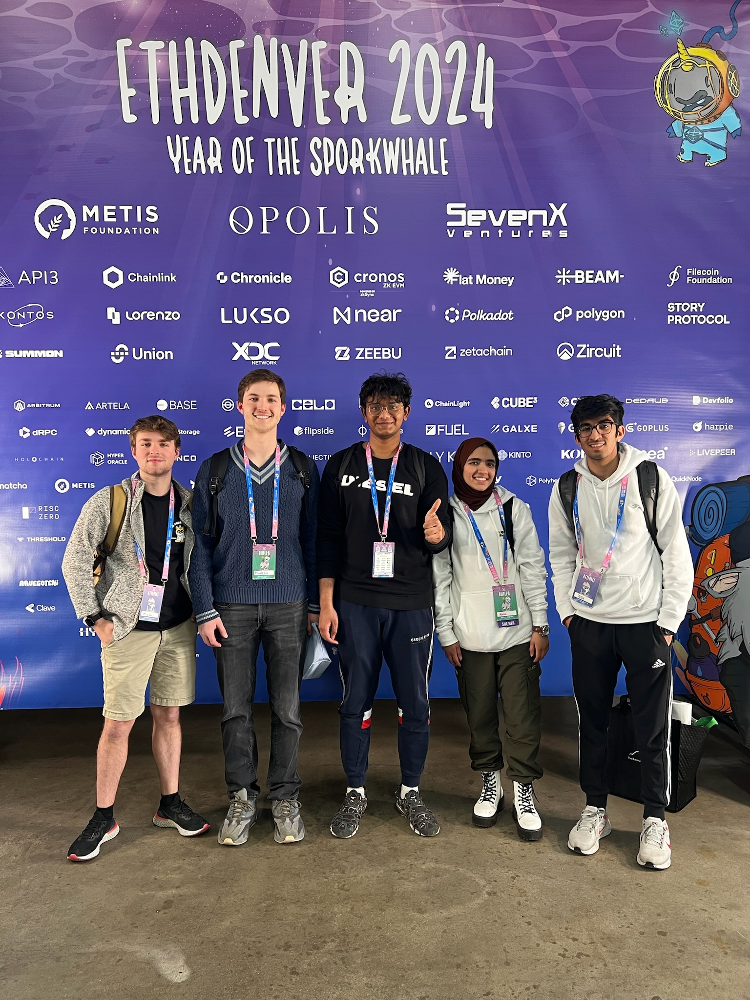
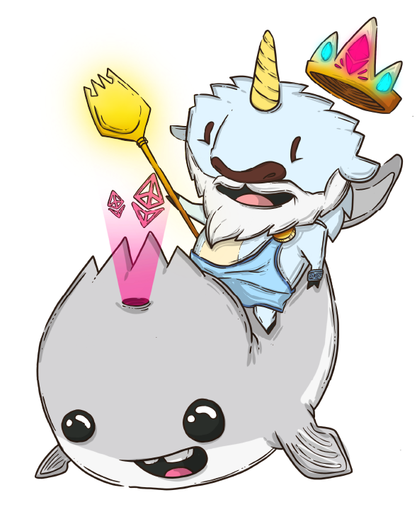

# In February 2024, the University of Kansas Blockchain Institute's Adventure at ETHDenver

In February 2024, the University of Kansas Blockchain Institute was able to take eleven members to [ETHDenver: a Community Innovation Festival](https://www.ethdenver.com/) offering a unique opportunity to explore blockchain technology with education, #BUIDLing, showcases, and special events.

<!-- truncate -->

## Core Community Outcomes

- Our **hackathon** team **won 1st prize** for **Best New Subgraph**! You can view the project [here](https://devfolio.co/projects/perpetual-organization-architect-d9bb).
- Two members are now participating in [SheFi](https://www.shefi.org/) cohort 10: a cohort-based educational program aimed at **accelerating careers** in web3 and AI.
- The **KUBI team won** the **4v4 Soccer tournament** at one networking event!
- One member was called up to be **featured on a panel** on blockchain education.
- One member was invited to present about KU Blockchain’s DAO at an EduDAO event.
- Overall, **education** and **exposure** across the board to new applications of blockchain in DePIN, Zero Knowledge, Attestation, and web3.
- **70+ new connections** in the industry.
- Four new connections who live in **Kansas**!

Additionally, KU Blockchain has now been approved to establish official partnerships with [Cabin](https://cabin.city/), [Filecoin](https://filecoin.io/), and several other companies!

## BUIDLathon + Camp #BUIDL

Four students drove to Denver 6 days early to participate in the hackathon and blockchain development bootcamp.

> Perpetual Organization Architect - the hackathon project built by Hudson Headley and Emma Nasseri - won first Prize for The Graph’s Best New Subgraph bounty. Read more [here](https://devfolio.co/projects/perpetual-organization-architect-d9bb).

## The Main Event

Seven students traveled out to join the group for the main event, where the focus on hacking shifted to networking, panels, booths, and educational events.

Together, we made lots of new friends and learned a lot about blockchain through the wonderful ETHDenver and Ethereum community!

### Some of the Best New Company Connections

- [Filecoin](https://filecoin.io/)
- [Metamask](https://metamask.io/)
- [EAS](https://attest.sh/)
- [Proof of Talent](https://proofoftalent.co/home/crypto-recruiters)
- [Polygon](https://polygon.technology/polygon-pos)
- [Coordinape](https://coordinape.com/)
- [Solana](https://solana.com/)
- [Cabin](https://cabin.city/)

### Some of Our Best New Community Connections

- [SheFi](https://www.shefi.org/)
- [CollegeDAO](https://collegedao.io/)
- [Crypto Girls Club](https://www.cryptogirlsclub.org/)
- [Filecoin Orbit Program](https://filecoin.io/blog/posts/orbit-community-program/)
- [EduDAO](https://www.edudao.io/)
- [Boys Club](https://www.boysclub.vip/) (specifically for women and non-binary people)

