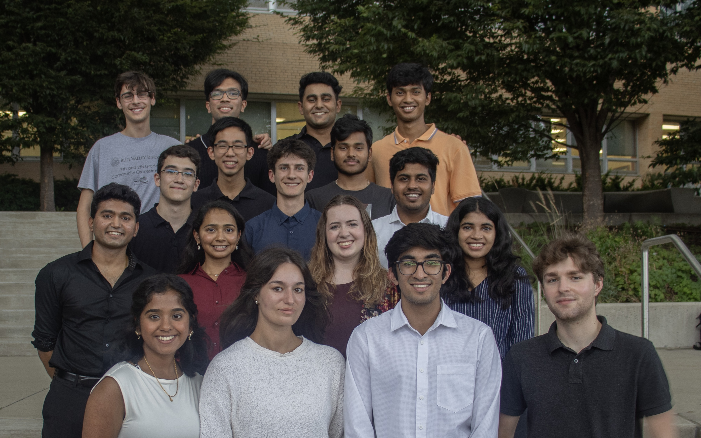
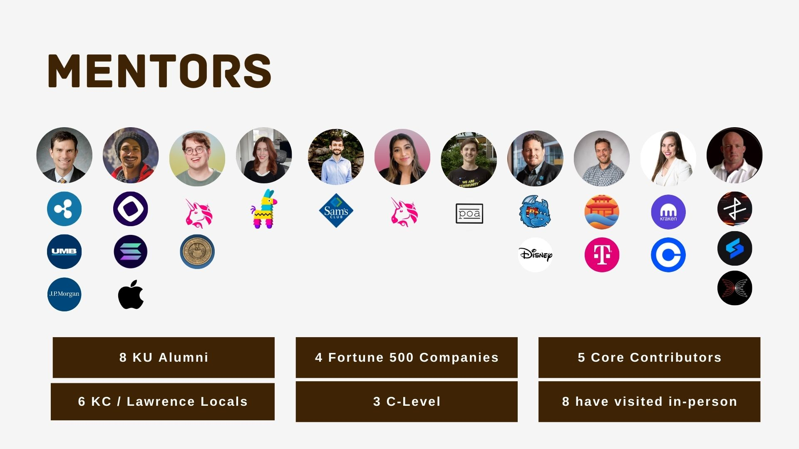
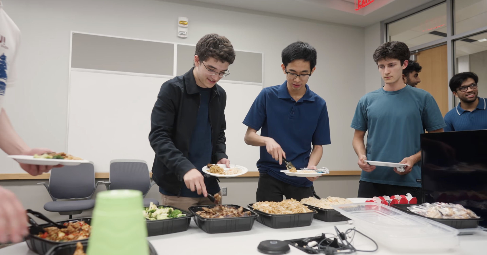
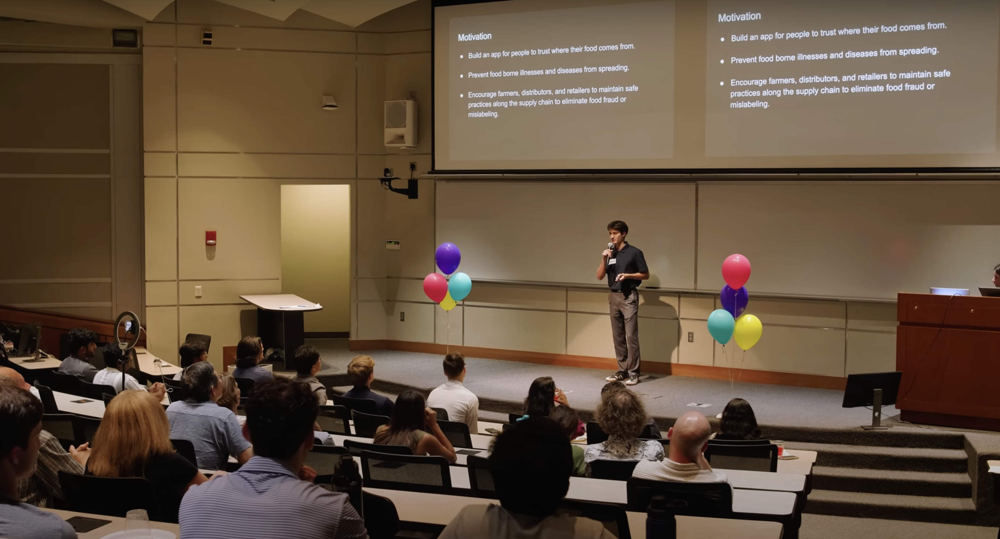

# Highlights from Cohort 1.0 of the Kansas Blockchain Fellowhsip

This year, the leadership team of the KU Blockchain Institute launched the Kansas Blockchain Fellowshp: a seven-week experiential learning-intensive, scholarship program, and talent incubator to prepare students in Kansas for careers in blockchain and web3.

You can watch our full **[Program Recap here](https://www.youtube.com/watch?v=NCb_VALLJcw)**

The program is designed to give exceptional students in the Midwest deep knowledge and experience around blockchain, digital assets, and web3. It is a professional experience crafted to either accompany or replace a summer internship.

<!-- truncate -->

16 students were selected for Cohort 1.0, which received support and educational materials from [Pinata](https://pinata.cloud/), [Ripple](https://ripple.com/), and [a16z crypto](https://a16zcrypto.com/).

Emma Nasseri, president of the KU Blockchain Institute and a final year KU honors computer science and visual arts student, led the design and planning process for KBF. “I’m so excited to see what doors open for students because of this opportunity to learn and independently build on blockchain,” says Nasseri. “We have an incredible community of students, researchers, and industry leaders with roots in Kansas, committed to supporting this cause and driving blockchain education and adoption in the Midwest.

KBF consisted of:

- Classes every Thursday from 7 to 9 p.m. CST from June 11 through July 23 (meals are provided at every class)
- A scholarship for each participating student
- A bonus, quadratically allocated award pool for outstanding projects
- Unique portfolio-building and networking opportunities

There were 12 mentors in total, bringing an impressive range of experience from companies like Uniswap, Ripple, Apple, Solana, IOHK, Kraken, Coinbase, and more.

Each week in class, students would gather for dinner, where they spent time getting to know each other and sharing ideas.

In the last three weeks of the program, each student successfully built and presented a full-stack web3 project. You can view all of the projects on the [Devpost Gallery](https://kbf-capstones-24.devpost.com/project-gallery).

I2S Director Dr. Perry Alexander and Associate Director Dr. Jennifer Lohoefener serve as faculty advisors for the fellowship.
