# ETHGlobal SF 2024 Travel Diary

From October 16th to the 21st, the **University of Kansas Blockchain Institute** was able to bring 13 students to San Francisco, California. The purpose of this trip was to tour leading tech organizations such as _Google_, _Ripple_, and the _Internet Archive_. These tours provide an opportunity for students to learn from industry leaders in blockchain, fintech, and digital archiving. KUBI also attended [ETHGlobal San Francisco 2024](https://ethglobal.com/events/sanfrancisco2024): a blockchain hackathon bringing together developers, engineers, and innovators from around the world to collaborate on building decentralized applications, tools, and protocols.

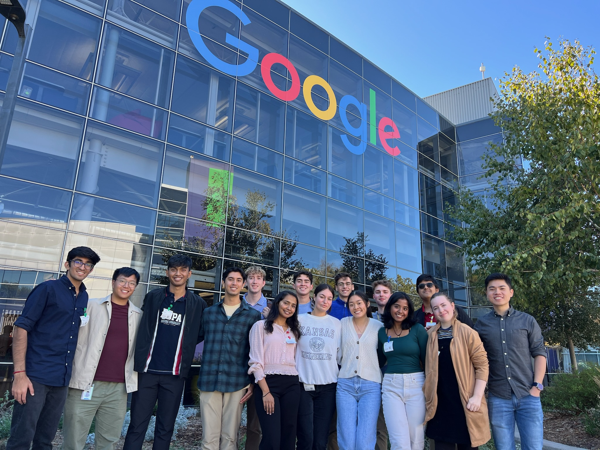

<!-- truncate -->

## Epic Outcomes

- 💻 5 KUBI hackathon teams successfully submitted projects, using technologies like Flow, Polygon, Story Protocol, and Privy!
  - Our projects racked in over $3,000 in prizes!
- 🎂 Alex’s and Ellia’s birthdays!!
- 🍣 Some people’s first time trying sushi
- 🍔 Some people’s first time at In-N-Out Burger
- 😎 Tons of freebies, ice cream walks, sightseeing, new connections, and an overall amazing experience at ETHGlobal SF!

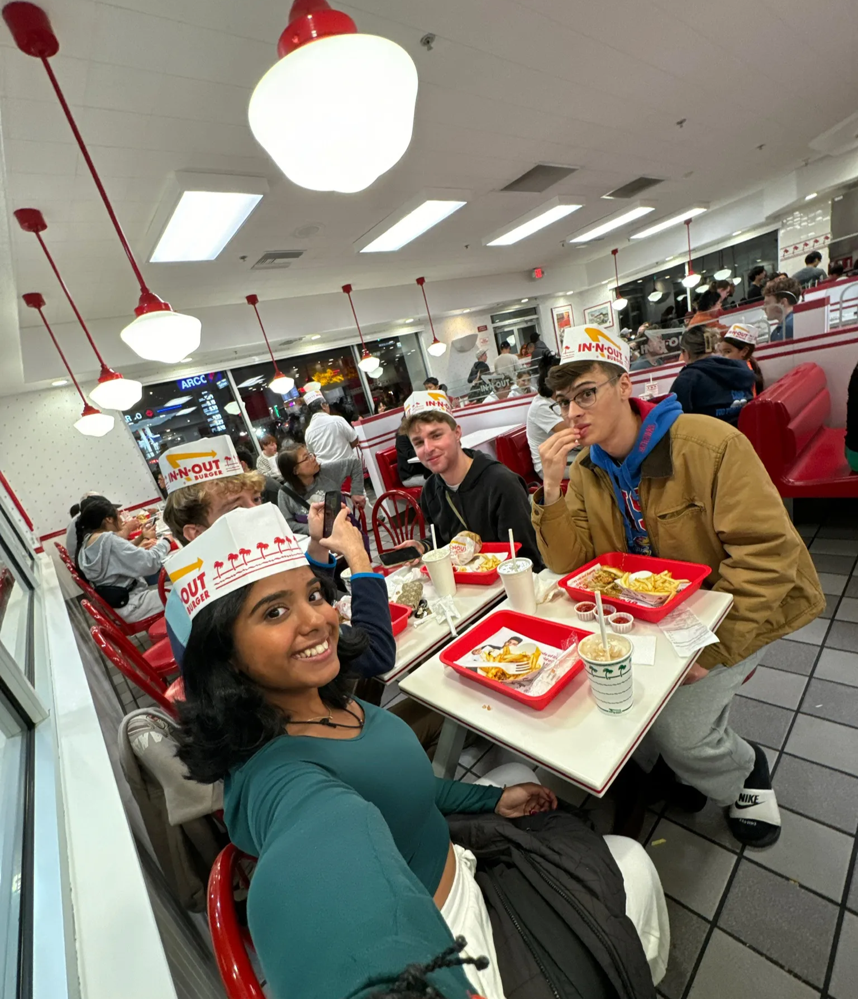

# Day 1

We started the day at Ripple HQ with a tour and presentations from current Ripplers on the internet of value and revolutionary technology being developed on the XRP Ledger. We heard from a software engineer, a financial analyst, a data scientist, and a developer advocate (Emma Nasseri!!). Thanks for hosting us, Ripple!

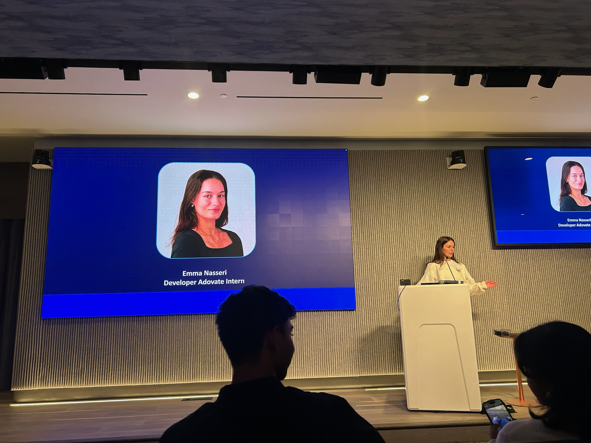

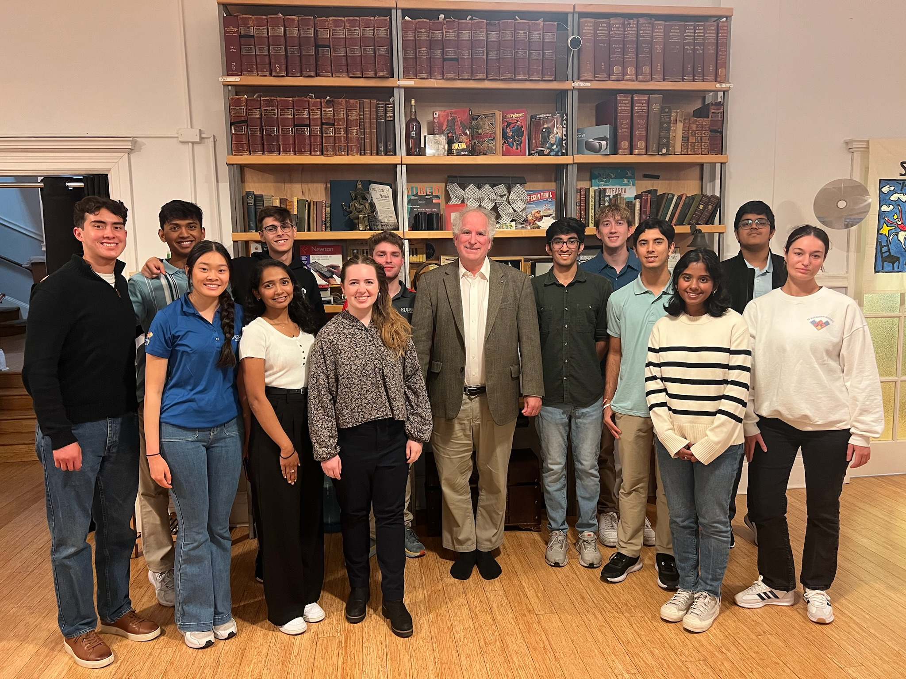

We walked through Chinatown on our way to the Internet Archive. Mark Graham and Brewster Kahle met with our students, gave us a tour, and shared interesting perspectives on the role of decentralization in the preservation of the internet. KUBI students asked a lot of thought provoking questions to Mark and Brewster! Thank you, Internet Archive!

We did some sightseeing in the evening, and had clam chowder on the pier. Amazing first day! 🎉

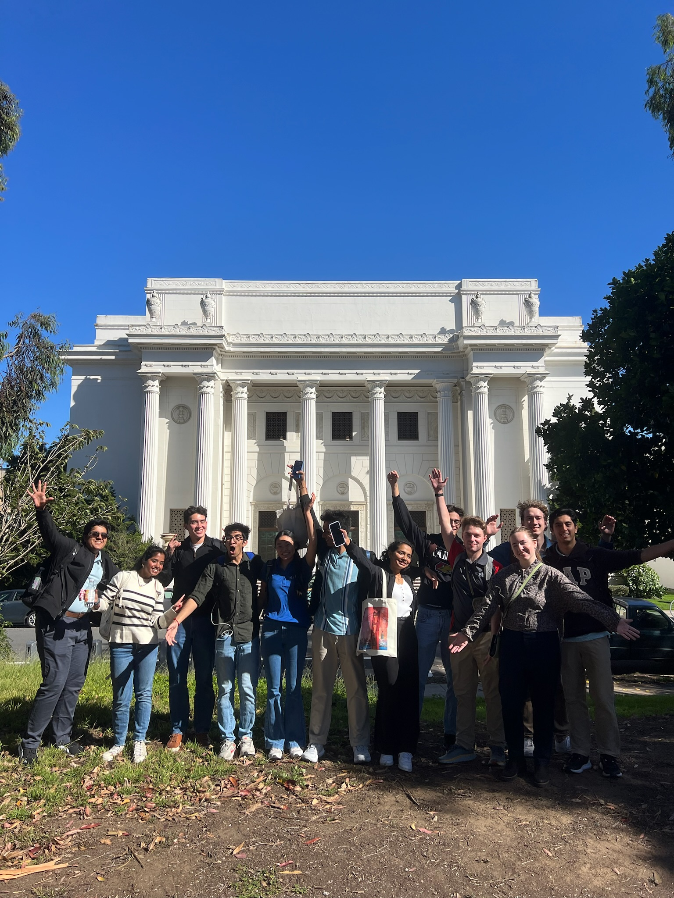

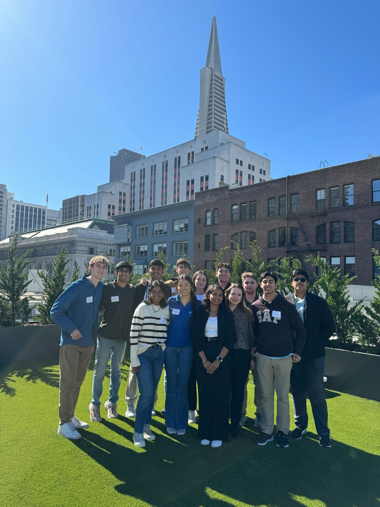

# Day 2

We took the CalTrain down to Mountain View and visited some Googlers from Kansas, Matt and Harry! They gave us an amazing tour of Google HQ and taught us so much about how Google is innovating with emerging technologies and their journeys in tech. Thanks Matt and Harry!!!

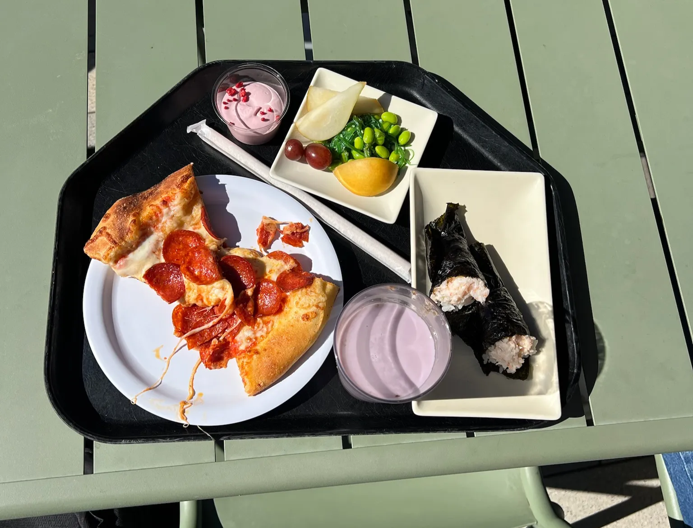

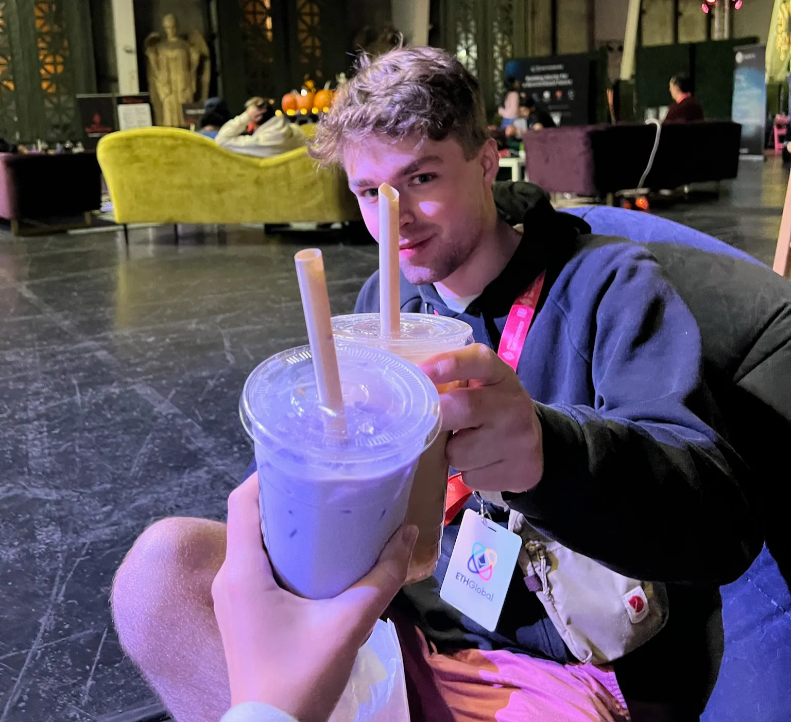

We took the CalTrain back to SF with a quick stop in Palo Alto before we headed to the Palace of Fine Arts for the ETHGlobal SF hackathon kickoff!

We started hacking at 9pm on Friday, with a few quick breaks for free food trucks, swag pick-ups at the booths, and midnight boba tea and mochi donuts! 🍩🧋

# Days 3 and 4

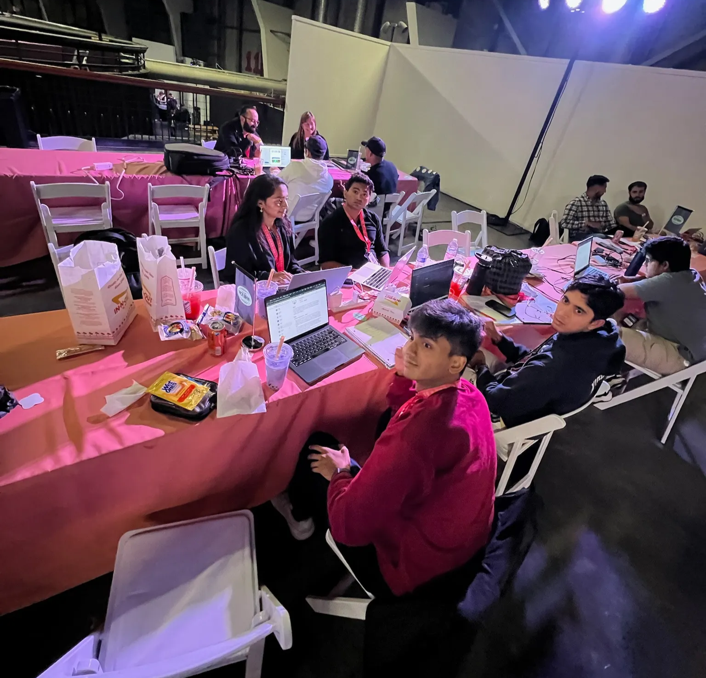

Days 3 and 4 were strictly developing. We were back to business working on our hackathon projects.

Some spent almost the entire 36-hours at the hackathon venue, catching naps in the _cozy_ air mattress sleeping room!

Many of us worked with mentors to help fix bugs, and made great connections with industry professionals!

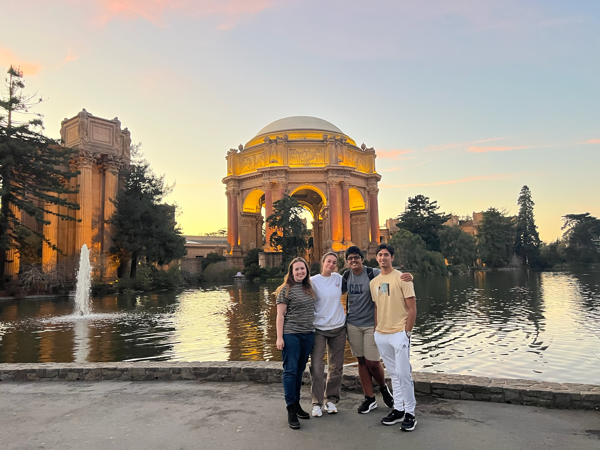

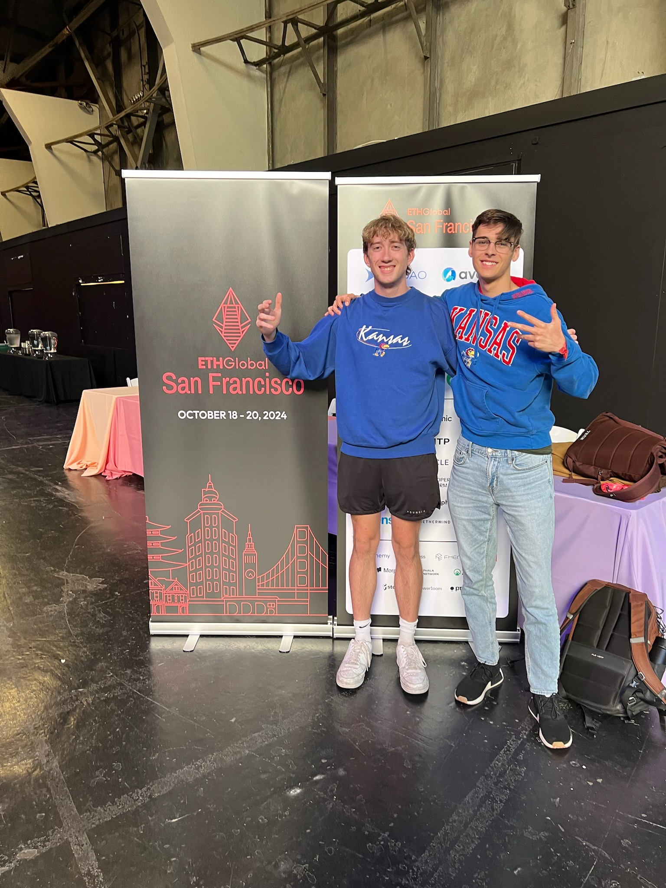

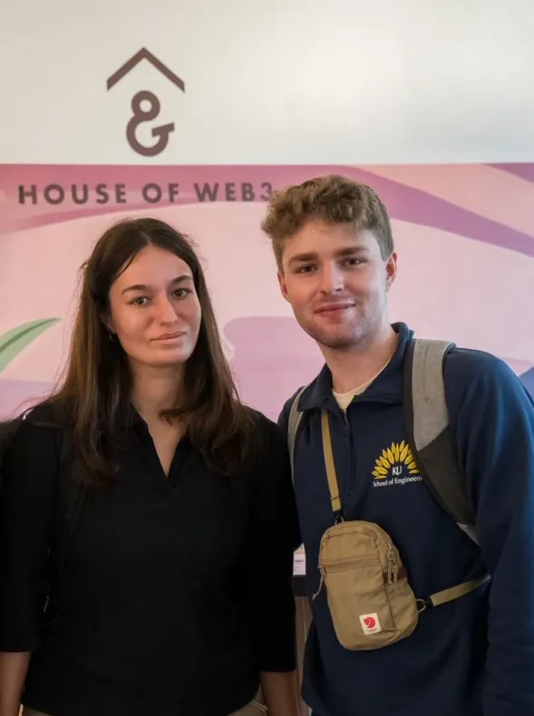
