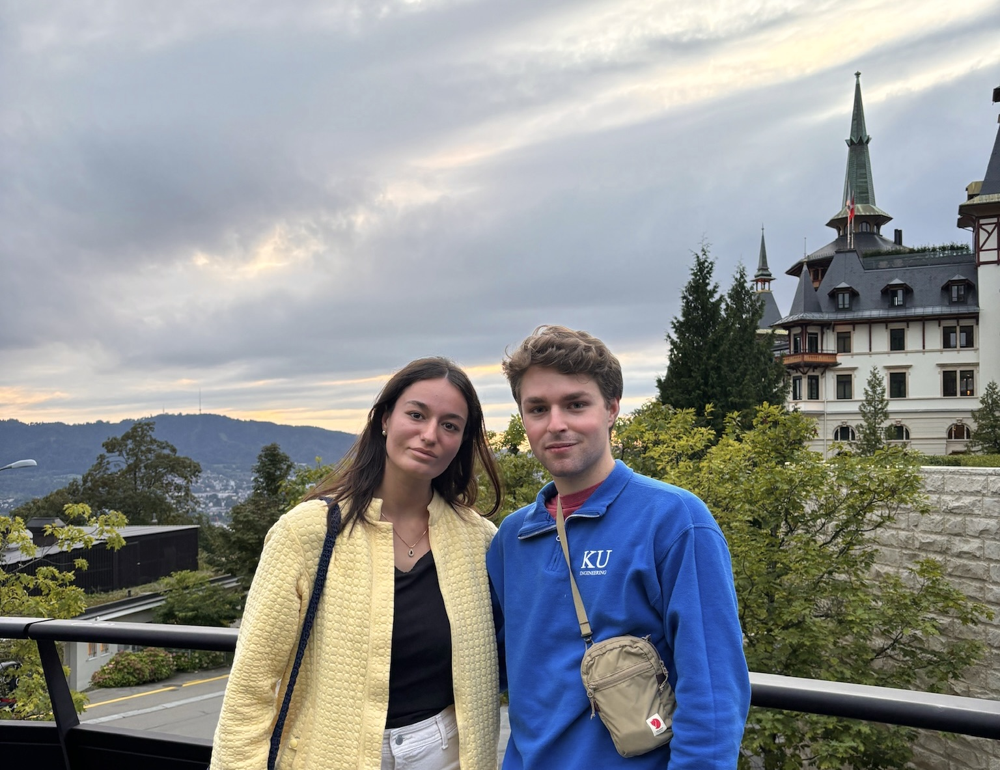
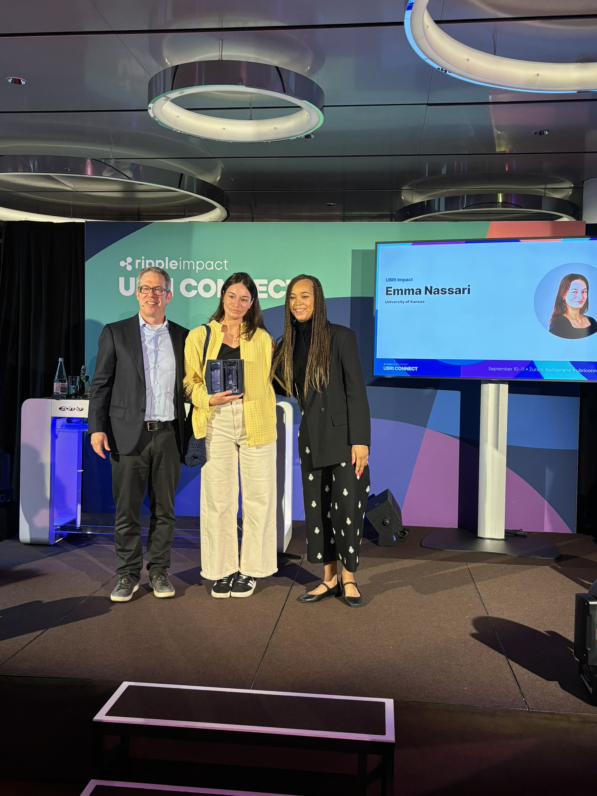
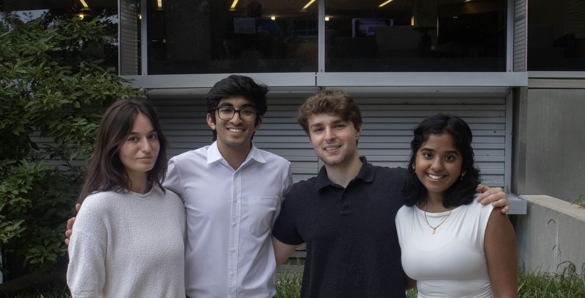
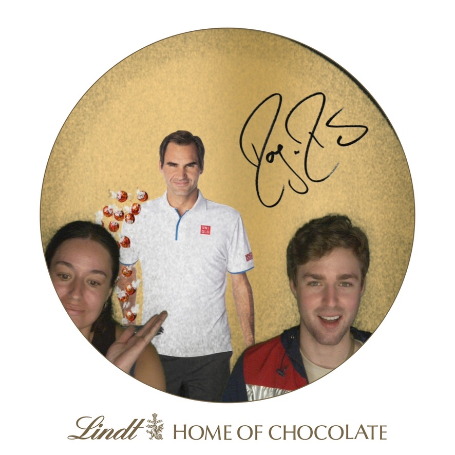

# UBRI Connect 2024 Travel Diary

This October, part of KUBI's core leadership team traveled to Zurich, Switzerland for Ripple's University Blockchain Research Initiative (UBRI) Connect Conference. [UBRI Connect](https://www.ubriconnect.com/), hosted by Ripple, brings together scholars, researchers, and thought leaders from across the globe to showcase and celebrate exceptional blockchain research and innovation.

<!-- truncate -->

The conference was held in the scenic city of Zurich, Switzerland a global hub for finance and technology. It featured world-class speakers and researchers from Stanford, Berkeley, National University of Singapore, Ripple, XRPL Commons, and more.

During the event, Emma Nasseri was honored with the [UBRI Impact Award](https://i2s-research.ku.edu/news/article/ku-student-receives-leadership-award-for-blockchain-research-initiative-on-international-stage) for her outstanding leadership in directing the [Kansas Blockchain Fellowship](https://www.kansasblockchain.org/). This initiative, a seven-week scholarship program and talent incubator, prepares students in Kansas for careers in blockchain technology and web3, fostering a new generation of tech innovators. You can [read more about KBF here](kbf-2024).

Emma shared her gratitude, saying, “I was so honored to receive Ripple’s UBRI Impact Award for the success of the Kansas Blockchain Fellowship, which could not have succeeded as it did without our community and the incredible student leadership team: [Micah Borghese](https://www.linkedin.com/in/micah-borghese/), [Jahnvi Maddila](https://www.linkedin.com/in/jahnvi-maddila-228359250/), and [Yash Prajapati](https://www.linkedin.com/in/yashprajapati23/). I am so proud of and grateful for our Fellows, alumni mentors, our community at KU Endowment and I2S, and the support we received from our external partners at [Pinata](https://pinata.cloud/), [Ripple](https://ripple.com/), and [a16z crypto](https://a16zcrypto.com/).”

The event not only highlighted KUBI's incredible 2024 achievements, but also inspired the leadership team with a new wave of energy to continue expanding blockchain education, research, development, and opportunities once back at KU.

We extend our deepest thanks to Ripple for their ongoing partnership and for providing such a transformative platform for our students at UBRI Connect. This celebration of blockchain research continues to fuel our commitment to innovation and excellence in the blockchain space.

To take full advantage of the unique travel opportunity, Emma and Micah were also sure to eat lots of swiss chocolate at the Lindt Museum, tons of fondue, and explore the beautiful cities of Zurich and Lucerne, enjoying their rich history and landmarks.

