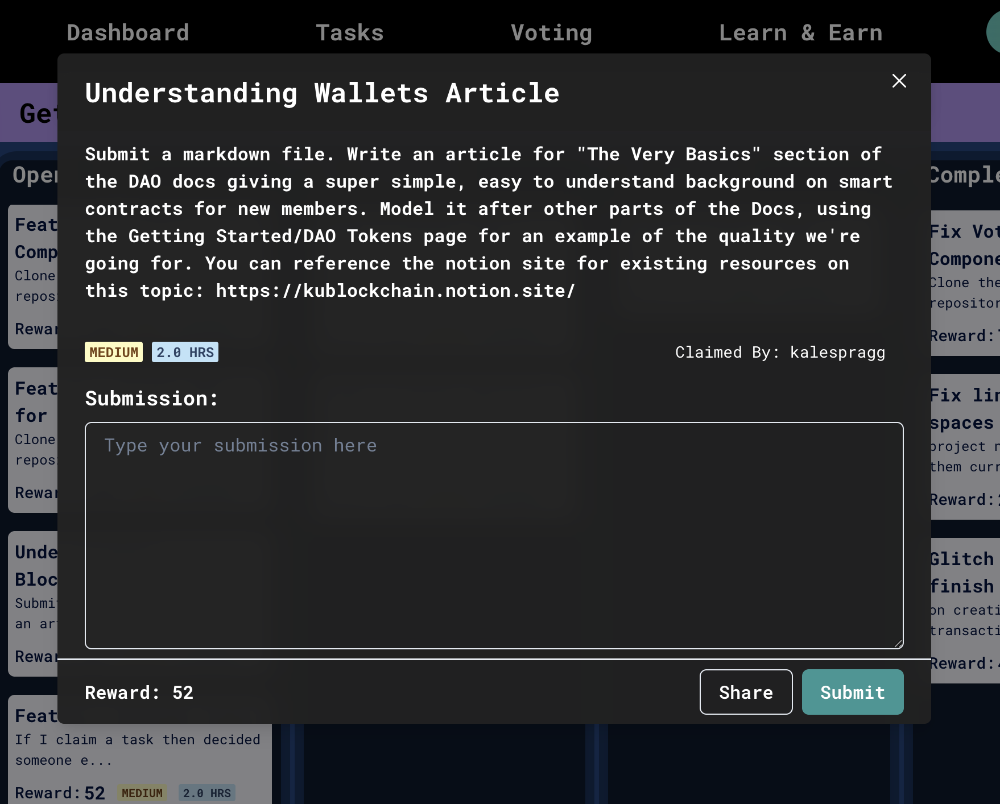

# Completing Tasks

## About Tasks

When they are first created, tasks have five attributes:

- A Title
- A Description
- An Estimated Time to Complete
- An Estimated Difficulty
- A KUBIx Bounty (automatically calculated based on the Estimated Time and Difficulty)

Currently, only Executive members can create tasks. When tasks are created, they by default exist in the Open column. This means they are open to anyone.

## Who can claim a task?

Any task in the DAO is open to anyone to claim. Sometimes, tasks will have a certain person's name next to them, meaning they were specifically designed for that person or fall under the responsibilities of that person's role. If you want to claim a task that has someone else's name in the title, just reach out to them first to make sure it's okay.

Until a task is claimed, it's fair game. Once a task is claimed, it will be moved into the In Progress column and will display the claiming member's name on it.

Here is an example task, where you can see all of the task's attributes. This task was claimed by Kyle (kalespragg in the DAO).

## Submitting Tasks

Tasks will typically outline what the submission should be in the description. For example, in the task above, the claimer is supposed to submit a markdown file. Since they have to submit a link, the claimer might submit a link to a Google Doc or Markdown File pushed to GitHub, according to their preference.

When you submit a link, just make sure to adjust the view permissions of your file so that anyone has permission to view it. This allows executives to easily review your task, mark it complete, and release your payout as quickly as possible.

> Note: Remember that every action in the DAO is an on-chain transaction. Once you submit the task, a Metamask pop-up will appear asking you to sign the transaction. Your submission won't go through unless the transaction is signed. This step might take a few moments( < 30 seconds).
