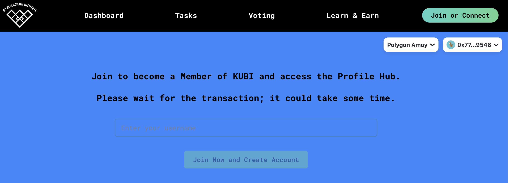

# Creating an Account

# Getting Started with MetaMask and Polygon

Welcome to our step-by-step guide on setting up your MetaMask wallet, loading it with Matic tokens from the Polygon Faucet, and creating your DAO username with your KU.edu email. This guide is tailored for beginners, so no prior knowledge of blockchain or web3 is necessary.

## Step 1: Downloading and Installing MetaMask

MetaMask is a digital wallet that allows you to manage your Ethereum and other blockchain assets. It also lets you interact with decentralized applications (dApps).

### Creating a Wallet with Metamask:

1. **Go to the MetaMask Website**:
   - Open your web browser and navigate to [MetaMask.io](https://metamask.io/).
2. **Download the Extension**:
   - Click on the "Download" button. Choose the version that corresponds to your browser (Chrome, Firefox, Edge, or Brave).
3. **Install MetaMask**:

   - Follow the instructions to add the MetaMask extension to your browser.

4. **Create Your Wallet**:
   - Open MetaMask by clicking on the extension icon in your browser toolbar.
   - Click on "Create a Wallet" and agree to the terms.
   - Create a strong password and write down your secret recovery phrase. Keep this phrase safe and private; it's the key to your wallet!

## Step 2: Acquiring Matic Tokens from the Polygon Faucet

Polygon uses Matic tokens for transaction fees. To interact with our DAO, you'll need some Matic in your wallet.

> **NOTE:** Since the DAO is currently deployed on the Amoy testnet, there is **no real money involved** in any of the DAO transactions, and the tokens hold no monetary value.

### Steps to Fund Your Wallet:

1. **Copy Your Wallet Address**:

   - Open MetaMask.
   - Click on the account name at the top of the wallet to copy your wallet address.

2. **Visit the Polygon Faucet**:

   - Go to the [Polygon Faucet](https://faucet.polygon.technology/).
   - Select the "Amoy" network, as it's the test network for Polygon.

3. **Receive Matic Tokens**:
   - Paste your wallet address into the faucet's address field.
   - Complete any required captcha or verification tasks. You will probably have to connect your Discord too.
   - Click "Submit" to receive your free Matic tokens.
   - It may take a few minutes for the tokens to appear in your wallet.

## Step 3: Creating Your DAO Account

<!-- To participate in the DAO, you need to create a username associated with your **ku.edu email**. This will help us verify your identity as a student or faculty member. -->

### Instructions:

1. **Access the DAO's User Page**:

- Navigate to the user page of the [DAO site](https://dao.kublockchain.com/user/).
- Click 'Connect Wallet' to begin creating an account.

2. **Connect Metamask**

- While you can use any EVM wallet on the DAO, we recommend Metamask.
- Once you select Metamask, a confirmation window will open asking you to confirm the connection. Click 'Connect' to log in with your Metamask wallet.

3. **Set Your Username**:
   

   - Follow the prompts to choose a username for your DAO account.
   - Ensure your username is unique and represents your identity within the DAO.

4. **Confirm Account Creation**:
   

- Once you click 'Join Now and Create Account,' the Metamask pop-up will reappear as DAO asks you to confirm the transaction. Don't be concerned by the term 'transaction,' as there is no real money involved. You are required to sign for transactions on the DAO only because the data is being logged on the blockchain.

5. **Explore the Profile Hub**
   

- Once the transaction has successfully been signed, you will be routed to your new profile hub, where you can explore recommended tasks and get started contributing.
- If you're not sure where to start, check out the [learning modules in the EduHub](https://dao.kublockchain.com/edu-Hub/) to learn about blockchain technology and how it's used in tools like the DAO.

## Conclusion

Congratulations! You now have a MetaMask wallet loaded with Matic and a username linked to your wallet address. You're all set to explore and participate in the DAO. If you encounter any issues or have questions, feel free to reach out to a KUBI member.

Remember, keep your wallet details and secret recovery phrase secure, as they are crucial for your digital identity and assets.
