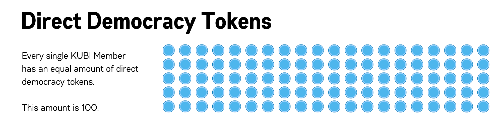
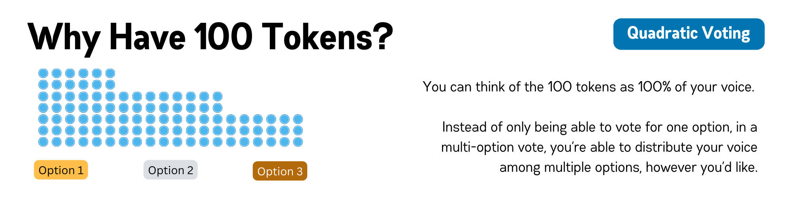
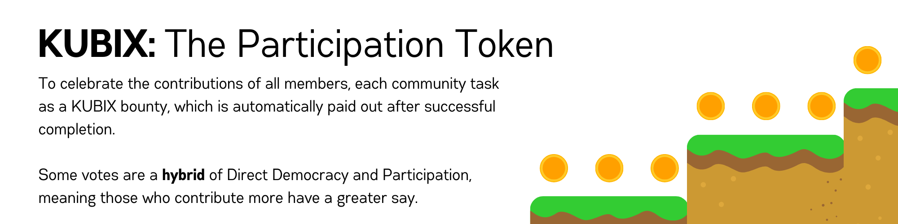
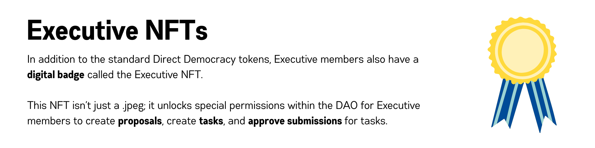
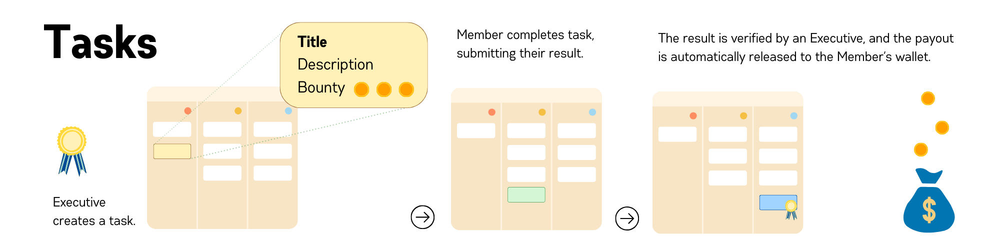

# Understanding Tokens in The DAO

While you don't need a deep understanding of KUBI tokens to use the DAO, this is a helpful introduction to understanding the basics of what these tokens are, how they work, and why they are important. There are 3 three main tokens used in the DAO: KUBIX tokens, Executive NFTs, and Direct Democracy tokens.

> **Important Note:** None of these tokens have any monetary value. They are just designed to ensure fair voting, participation tracking, and admin privileges.

## First, what are Tokens?

In the context of blockchain and cryptocurrencies, a token represents a unit of value issued by an organization or project. It can have various uses such as granting access to services, representing voting power, or even as a reward system. Tokens are digital and can be transferred between individuals or entities on a blockchain network.

For a more technical description of tokens, go to [Understanding Tokens](../the-very-basics/understanding-tokens.md)

# The 3 Tokens of the DAO

## Direct Democracy Tokens

100 Direct Democracy tokens are issued to each member who joins our DAO.

But why have 100 tokens, instead of just one?

Quadratic voting is a voting system that allows participants to more accurately express their preferences about multiple options.

> **For example:** If the vote was pizza 🍕, burritos 🌯, or sushi 🍣 at the next KUBI meeting, you might really want burritos 🌯, but sushi 🍣 might be your second choice. While you can choose to give 100% of your vote to burritos 🌯, you could also choose to divide it 70/30 between your top two choices.

## KUBIX Tokens

KUBIX tokens are the participation token of the DAO. They are used to recognize members for their participation.

Members can earn KUBIX by **attending meetings**, **completing community tasks**, or **completing learning modules**.

> KUBIX are an important aspect of the DAO because it allows every member to have a quantifiable sense of how much they've contributed. This could be useful in your **resume** or at a **job interview**, where you could prove how much you contributed to KUBI by sharing an strong metric like your place in the leaderboard or number of hours contributed.

## Executive NFTs

NFTs, or Non-Fungible Tokens, are unique digital tokens that represent ownership of a specific item or privilege. In our DAO, Executive NFTs are special tokens that grant the holder executive privileges.

## How does this all fit together?

Here's an example of **KUBIX** and **Executive NFTs** are important through the lifecycle of a community task.

### If you're confused...

It's totally okay to be confused at first - tokens can be tricky to get the hang of. Even if you're confused, don't be afraid to jump in anyways! It's often easier to learn as you go.
