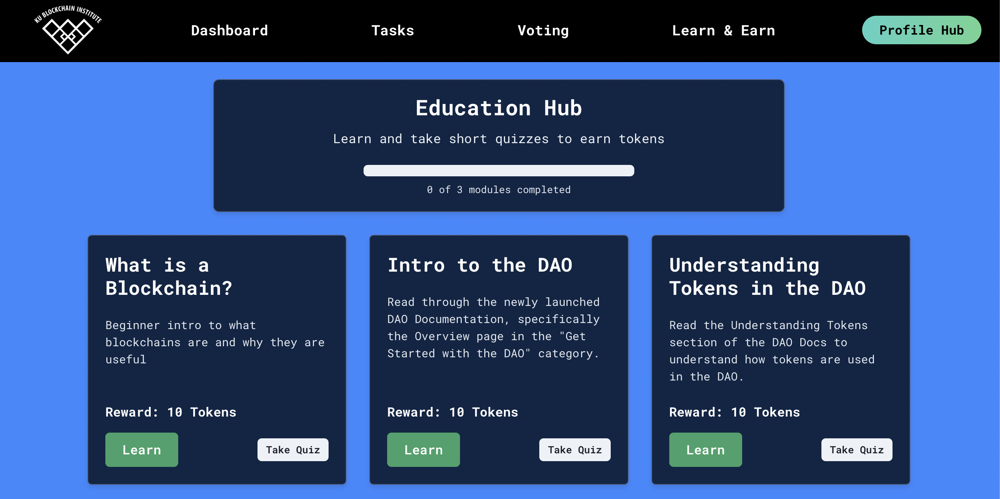
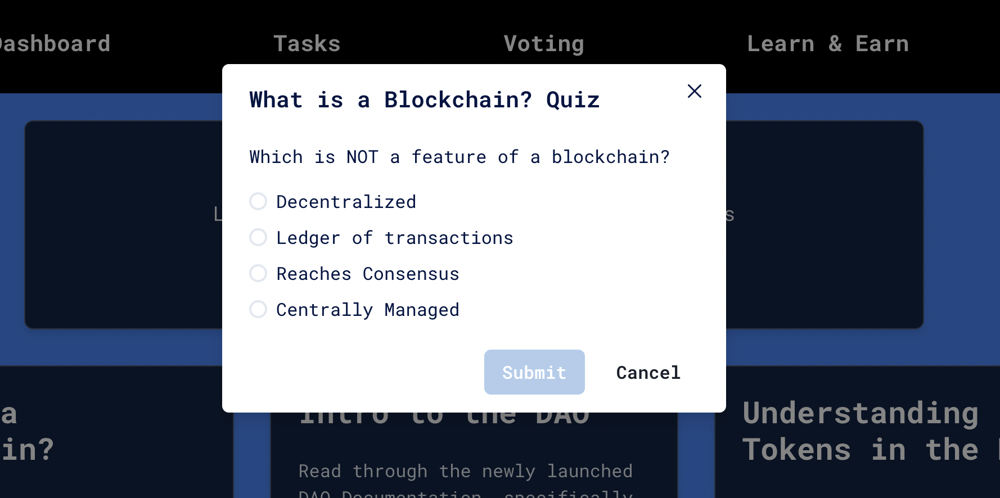

# Learn and Earn

One of the best ways to begin earning KUBIX through the DAO is through the ['Learn & Earn'](https://dao.kublockchain.com/edu-Hub/) page of the DAO. Here, you can find learning modules with bounties for completion.

## Why We Have Education Modules

One of the three main pillars of KUBI is blockchain education. We have designed these educational modules to kickstart your blockchain education journey. Each module covers basic topics, and members are **highly encouraged** to pursue further learning on their own. For a more in-depth exploration, members can visit the [KUBI Notion Page](https://kublockchain.notion.site/Foundations-of-Blockchain-7ff28f61d6c347feb624866d32f0242b) for thorough readings.

## How to Complete

Click the 'Learn' button on any module to find the learning resource. After going through the learning resource, you can click 'Take Quiz' to open up the mini-quiz. Once you get the answer right, you'll be automatically paid out the bounty for that learning section.

> **Important Note:** Don't take shortcuts on these quizzes! We know that it would be easy to just look up the answers, but the purpose of this feature of the DAO is to make learning more rewarding.

## Who to Contact If Lost

If you have questions or need guidance, feel free to contact our current Directors of Education, [Nischay Rawal](mailto:nrawal@ku.edu) and [Wolfgang Sell](mailto:wolfgangsell@ku.edu)

**Happy learning!**
