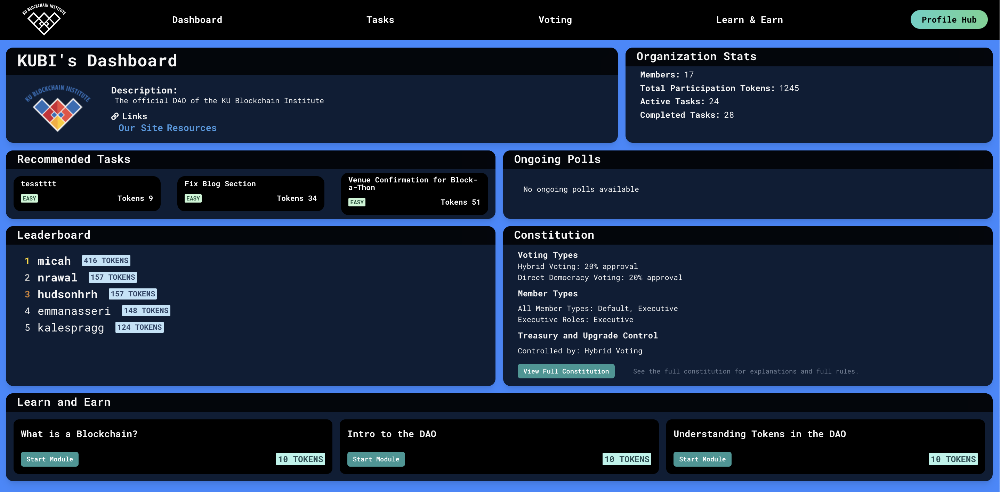
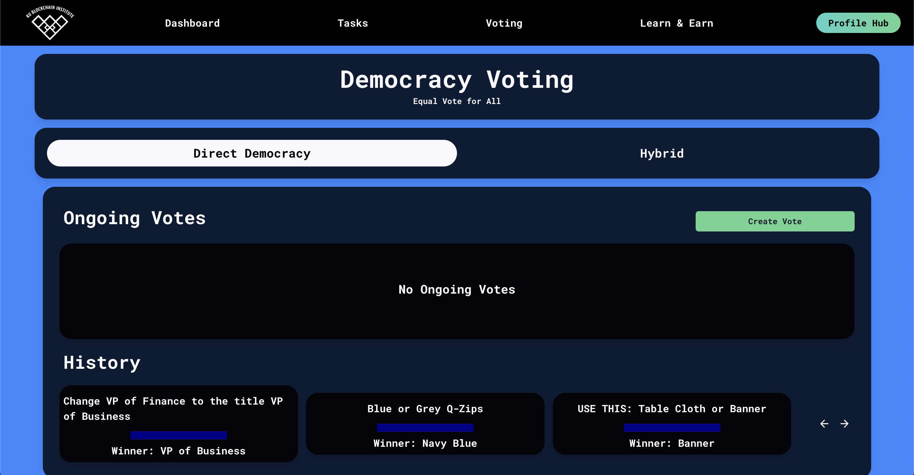

# Welcome to the KU Blockchain Institute DAO

## Overview

The KU Blockchain Institute DAO is a decentralized autonomous organization designed to empower club members by facilitating democratic participation in decision-making processes and task management. Built entirely from scratch in 2023-2024, this platform leverages blockchain technology to ensure transparency, accountability, and efficiency.

You can read about the [history of the DAO here](https://docs.kublockchain.com/blog/history-of-the-KUBI-DAO).

## Primary Purposes of the DAO

There are a lot of advantages to the KUBI DAO, but

1. **Enabling Democracy**: The DAO is a tool for ensuring every KUBI member has an equal opportunity to be recognized for their contributions.
2. **Empowering Developers**: Giving members structured opportunities for hands-on learning and experimentation in web3 through open source contribution.
3. **Incentivizing Learning and Engagement**: Rewarding the effort and impact that simple contributions like learning and attending meetings have on our community.

## Key Features

### **Dashboard**

On the Dashboard page, members can access and review the DAO constitution, which outlines KUBI's governance rules and operational guidelines. There is also a leaderboard that tracks and displays member contributions and activity within the DAO.

### **Task Manager**

Members can view and take on various tasks needed by the club. Each task includes a title, a detailed description, and an associated bounty in KUBIX tokens, which are calculated based on the task's estimated difficulty and time required.

### **Voting Platform**

There are two types of votes within the DAO:

- **Direct Democracy**: Every member has a vote on decisions impacting the club like elections for the executive team, ensuring each voice is heard.
- **Participation-Based Voting**: Votes are weighted based on members' participation and contributions, promoting active involvement.

### **Education Hub**

Also known as the Learn and Earn page, this part of the DAO has a series of bounties for members just getting started, so that even if they don't know anything about blockchain, they can be rewarded for the effort it takes to the basics.

### **Profile Hub**

Here is an example of the profile hub, which will look different for every user. This is where members can track their individual progress, current claimed tasks,

### Getting Started

1. **Visit the DAO**: Head over to our [DAO website](#) to begin.
2. **Create an Account**: Sign up to participate in tasks, voting, and more.
3. **Browse and Claim Tasks**: Check out the Task Manager to start earning KUBIX tokens.
4. **Participate in Voting**: Have your say in our next club decision or election.
5. **View the Constitution**: Familiarize yourself with the rules and ethos governing our club.
6. **Check the Leaderboard**: See how you stack up against other members in contributions.

No matter what level of blockchain knowledge you come in with, the DAO is designed to ensure you can easily participate and contribute to the governance of our community.

For detailed instructions on each feature, refer to the subsequent sections of this documentation.
