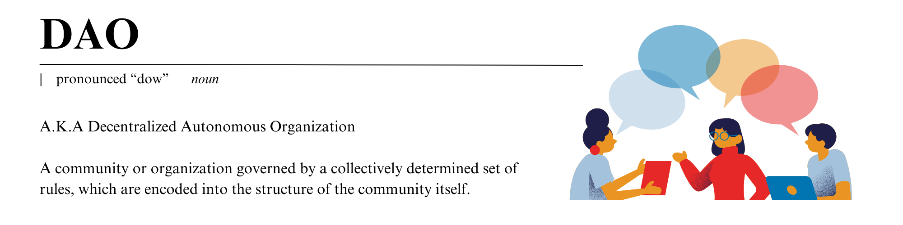

# Definition of a DAO

The term "DAO" can mean a lot of things. It stands for **"Decentralized Autonomous Organization."**

Let's start by breaking down the literal definition.

- **Decentralized**: Not controlled by a single entity or central authority. In the context of a DAO, this means that control is spread across all members who have a stake or a role, rather than being concentrated in the hands of a few.
- **Autonomous**: Able to operate independently without the need for human intervention. A DAO operates according to rules encoded as computer programs called [smart contracts](understanding-smart-contracts), which automatically execute decisions based on the inputs from its members.
- **Organization**: A group of individuals who come together for a common purpose. In a DAO, this group collaboratively makes decisions and manages resources collectively, leveraging blockchain technology to ensure transparency and fairness.

# DAOs in Practice

DAO is often interpreted to mean any organization with smart contract based governance. DAOs are commonly seen as efficient ways for a distributed group of people to organize online to make governance decisions or manage a pool of shared funds.

### Well-known DAOs

1. **[Uniswap DAO](https://uniswap.org/)**

   - **Focus**: Governance of the Uniswap decentralized exchange.
   - **Known for**: Manages the Uniswap protocol, a leading decentralized finance (DeFi) platform on Ethereum for token swaps without a central intermediary.

2. **[ConstitutionDAO](https://www.constitutiondao.com/)**

   - **Focus**: Collecting funds to purchase a rare copy of the U.S. Constitution.
   - **Known for**: Demonstrated collective action through Ethereum, despite not winning the auction, highlighting the power of DAOs.

3. **[MakerDAO](https://makerdao.com/)**

   - **Focus**: Managing the DAI stablecoin.
   - **Known for**: Issues DAI, a crypto-collateralized stablecoin that maintains a value close to one US dollar, crucial in the DeFi ecosystem.

4. **[Nouns DAO](https://nouns.wtf/)**

   - **Focus**: Funding initiatives that increase the cultural significance of Nouns NFTs.
   - **Known for**: Mints one Noun (NFT) daily, granting NFT owners voting rights in the DAO to decide on proposals that benefit the broader NFT and crypto communities.

5. **[MoonDAO](https://www.moondao.com/)**

   - **Focus**: Expanding access to space.
   - **Known for**: Aims to decentralize access to space by funding missions and developing space-related technologies.

6. **[Gitcoin DAO](https://gitcoin.co/)**
   - **Focus**: Funding open source software development.
   - **Known for**: Provides a platform to fund and coordinate resources in open source development, particularly in the Ethereum and broader Web3 ecosystem, promoting public goods and digital infrastructure.
